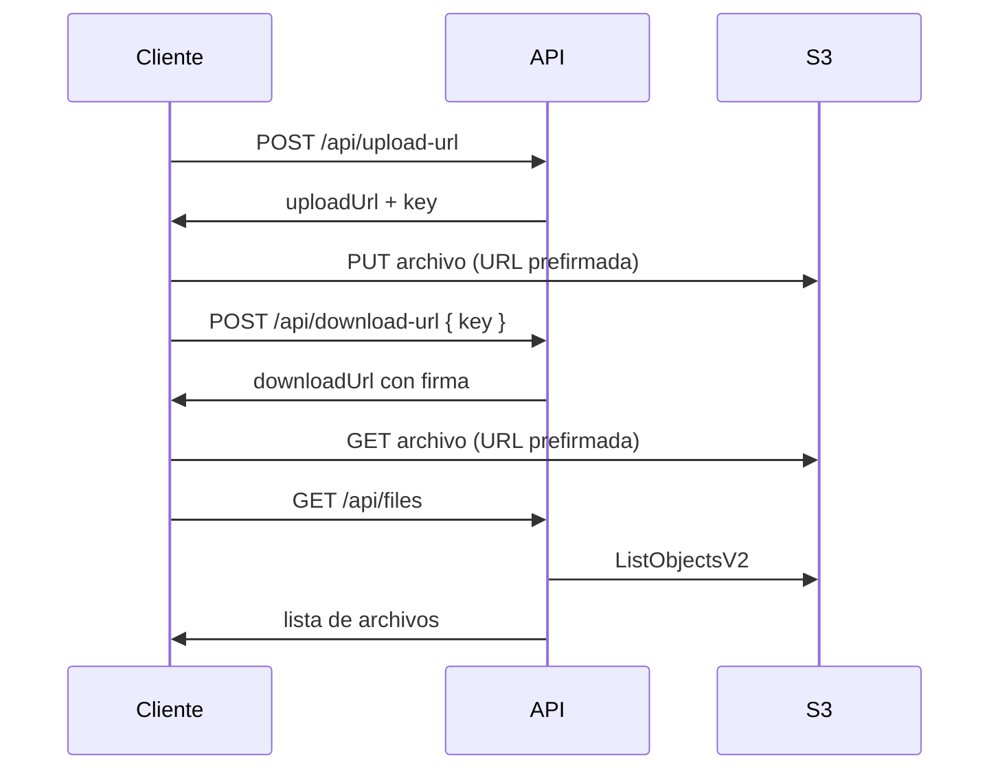

# paoS3 — API de URLs prefirmadas para S3

Mini proyecto en Node.js que expone una API REST para:

- Generar URLs prefirmadas de **subida** a un bucket S3 privado
- Generar URLs prefirmadas de **descarga** con token/firma temporal
- **Listar** archivos subidos en el bucket

Los archivos no son públicos. Solo se accede mediante URLs prefirmadas que expiran después de un tiempo configurable.

---

## Inicio rápido

El proyecto ya viene con **credenciales AWS y bucket configurados** en el archivo `.env`. No necesitas crear nada en AWS para probarlo.

### Requisitos

- **Node.js** 18 o superior
- **npm**

### Pasos

```bash
# 1. Entrar al proyecto
cd paoS3

# 2. Instalar dependencias
npm install

# 3. Iniciar el servidor
npm start
```

Deberías ver:

```
Servidor escuchando en http://localhost:3000
UI disponible en http://localhost:3000
```

Abre en el navegador: **http://localhost:3000**

La interfaz incluye:
- Botón **Listar archivos**
- Botón **Subir archivo** (elige archivo + sube directo a S3)
- Botón **Descargar** en cada archivo listado

### CORS en S3 (requerido para subir desde el navegador)

La UI sube **directo a S3** con la URL prefirmada. El bucket debe permitir peticiones desde `localhost`. **Configúralo una sola vez** en AWS Console:

1. S3 → bucket `pao-demo-417755752809-us-east-2-an` → pestaña **Permissions**
2. Baja a **Cross-origin resource sharing (CORS)** → **Edit**
3. Pega este JSON:

```json
[
  {
    "AllowedHeaders": ["*"],
    "AllowedMethods": ["GET", "PUT", "HEAD"],
    "AllowedOrigins": [
      "http://localhost:3000",
      "http://127.0.0.1:3000"
    ],
    "ExposeHeaders": ["ETag"],
    "MaxAgeSeconds": 3000
  }
]
```

4. **Save changes**

> También está en `aws/s3-cors.json`. Si tienes permisos de admin: `npm run apply-cors`

Sin CORS, la subida desde el navegador falla aunque Postman/curl funcionen.

### Verificar que funciona

```bash
curl http://localhost:3000/health
```

Respuesta esperada:

```json
{ "ok": true }
```

### Modo desarrollo (opcional)

Recarga automática al editar código:

```bash
npm run dev
```

---

## Estructura del proyecto

```
paoS3/
├── .env              # Credenciales y config (ya incluido)
├── .env.example      # Plantilla de referencia
├── package.json
├── README.md
├── public/
│   ├── index.html    # Interfaz web de demo
│   ├── app.js
│   └── styles.css
└── src/
    ├── config.js     # Carga variables de entorno
    ├── index.js      # Servidor Express y rutas
    └── s3.js         # Lógica de S3 y URLs prefirmadas
```

---

## Cómo funciona



1. La API **no recibe el archivo** directamente en la subida.
2. Genera una URL prefirmada; el cliente sube el archivo **directo a S3** con `PUT`.
3. La descarga funciona igual: la API devuelve una URL prefirmada con firma (`X-Amz-Signature`, etc.) y el cliente hace `GET` a S3.
4. Las URLs expiran; después hay que pedir una nueva.

Los archivos se guardan bajo el prefijo `uploads/` con un UUID en el nombre para evitar colisiones.

---

## Endpoints

Base URL: `http://localhost:3000`

Importa los curl en Postman con **Import → Raw text**.

---

### `GET /health`

Verifica que el servidor esté activo.

**Request:** sin body.

**Response 200:**

```json
{
  "ok": true
}
```

**curl:**

```bash
curl --location 'http://localhost:3000/health'
```

---

### `POST /api/upload-url`

Genera una URL prefirmada para subir un archivo a S3.

**Headers:**

```
Content-Type: application/json
```

**Body:**

| Campo | Tipo | Requerido | Descripción |
|-------|------|-----------|-------------|
| `filename` | string | Sí | Nombre del archivo (ej. `foto.png`) |
| `contentType` | string | No | MIME type (default: `application/octet-stream`) |

**Ejemplo — PNG:**

```json
{
  "filename": "foto.png",
  "contentType": "image/png"
}
```

**Response 200:**

```json
{
  "key": "uploads/uuid-foto.png",
  "uploadUrl": "https://bucket.s3.region.amazonaws.com/uploads/uuid-foto.png?X-Amz-Signature=...",
  "expiresIn": 900,
  "method": "PUT",
  "headers": {
    "Content-Type": "image/png"
  }
}
```

**curl:**

```bash
curl --location 'http://localhost:3000/api/upload-url' \
--header 'Content-Type: application/json' \
--data '{
  "filename": "foto.png",
  "contentType": "image/png"
}'
```

**Subir el archivo a S3** (usa la `uploadUrl` de la respuesta):

```bash
curl --location --request PUT 'UPLOAD_URL_AQUI' \
--header 'Content-Type: image/png' \
--data-binary '@/ruta/a/foto.png'
```

En Postman: method **PUT**, URL = `uploadUrl`, Body = **binary**, header `Content-Type` igual al usado al pedir la URL.

**Content types comunes:**

| Tipo de archivo | contentType |
|-----------------|-------------|
| PNG | `image/png` |
| JPG | `image/jpeg` |
| PDF | `application/pdf` |
| TXT | `text/plain` |
| JSON | `application/json` |

---

### `POST /api/download-url`

Genera una URL prefirmada para descargar un archivo previamente subido.

**Headers:**

```
Content-Type: application/json
```

**Body:**

| Campo | Tipo | Requerido | Descripción |
|-------|------|-----------|-------------|
| `key` | string | Sí | Ruta del objeto en S3 (viene en la respuesta de upload) |

**Ejemplo:**

```json
{
  "key": "uploads/uuid-foto.png"
}
```

**Response 200:**

```json
{
  "key": "uploads/uuid-foto.png",
  "downloadUrl": "https://bucket.s3.region.amazonaws.com/uploads/uuid-foto.png?X-Amz-Signature=...",
  "expiresIn": 3600,
  "method": "GET"
}
```

**curl:**

```bash
curl --location 'http://localhost:3000/api/download-url' \
--header 'Content-Type: application/json' \
--data '{
  "key": "uploads/uuid-foto.png"
}'
```

**Descargar el archivo** (usa la `downloadUrl`):

```bash
curl --location 'DOWNLOAD_URL_AQUI' --output foto.png
```

En Postman: method **GET**, URL = `downloadUrl` completa. No hace falta enviar `Content-Type` en la descarga.

---

### `GET /api/files`

Lista archivos del bucket bajo el prefijo `uploads/` (por defecto).

**Query params (opcionales):**

| Param | Descripción |
|-------|-------------|
| `prefix` | Prefijo a listar (default: `uploads/`) |
| `maxKeys` | Máximo de resultados (default: 100) |
| `continuationToken` | Token para paginar si hay más resultados |

**Response 200:**

```json
{
  "bucket": "nombre-de-tu-bucket",
  "prefix": "uploads/",
  "count": 2,
  "isTruncated": false,
  "nextContinuationToken": null,
  "files": [
    {
      "key": "uploads/uuid-foto.png",
      "size": 1024,
      "lastModified": "2026-06-22T21:00:00.000Z"
    }
  ]
}
```

**curl:**

```bash
curl --location 'http://localhost:3000/api/files'
```

Con filtros:

```bash
curl --location 'http://localhost:3000/api/files?prefix=uploads/&maxKeys=20'
```

---

## Flujo completo de ejemplo

```bash
# 1. Verificar servidor
curl http://localhost:3000/health

# 2. Pedir URL de subida
curl -X POST http://localhost:3000/api/upload-url \
  -H "Content-Type: application/json" \
  -d '{"filename":"demo.png","contentType":"image/png"}'

# 3. Subir archivo (reemplaza UPLOAD_URL)
curl -X PUT -H "Content-Type: image/png" \
  --data-binary "@demo.png" "UPLOAD_URL"

# 4. Pedir URL de descarga (reemplaza KEY)
curl -X POST http://localhost:3000/api/download-url \
  -H "Content-Type: application/json" \
  -d '{"key":"uploads/uuid-demo.png"}'

# 5. Descargar (reemplaza DOWNLOAD_URL)
curl "DOWNLOAD_URL" --output demo-descargado.png

# 6. Listar archivos
curl http://localhost:3000/api/files
```

---

## Errores frecuentes

| Error | Causa probable |
|-------|----------------|
| `403 AccessDenied` al subir/descargar | Credenciales expiradas o policy IAM incorrecta |
| `403` en `/api/files` | Falta permiso `s3:ListBucket` en la policy IAM |
| `Falta la variable de entorno X` | Archivo `.env` faltante o incompleto |
| URL expirada | Pedir una nueva URL; las prefirmadas tienen tiempo limitado |
| `EADDRINUSE` puerto 3000 | Ya hay otra instancia corriendo; detenerla o cambiar `PORT` en `.env` |

---

## Scripts disponibles

| Comando | Descripción |
|---------|-------------|
| `npm start` | Inicia el servidor |
| `npm run dev` | Inicia con recarga automática (`--watch`) |

---

## Referencia: variables de entorno (`.env`)

El proyecto ya incluye un `.env` listo para usar. Estas son las variables que contiene:

| Variable | Descripción |
|----------|-------------|
| `PORT` | Puerto del servidor (default: 3000) |
| `AWS_REGION` | Región del bucket S3 |
| `AWS_ACCESS_KEY_ID` | Access key del usuario IAM |
| `AWS_SECRET_ACCESS_KEY` | Secret key del usuario IAM |
| `S3_BUCKET` | Nombre exacto del bucket |
| `UPLOAD_URL_EXPIRES_IN` | Segundos de validez de la URL de subida (default: 900 = 15 min) |
| `DOWNLOAD_URL_EXPIRES_IN` | Segundos de validez de la URL de descarga (default: 3600 = 1 h) |

Si en algún momento necesitas apuntar a otro entorno, copia `.env.example` y reemplaza los valores.

---

## Referencia: crear tu propio entorno AWS (opcional)

Esta sección es **solo si quieres levantar el proyecto con tu propia cuenta AWS**. Para el demo incluido no es necesario.

### 1. Crear bucket S3

1. AWS Console → **S3** → **Create bucket**
2. Elige una región (ej. `us-east-2`)
3. Deja activado **Block all public access**
4. Anota el nombre del bucket

### 2. Crear usuario IAM

1. AWS Console → **IAM** → **Users** → **Create user**
2. Nombre sugerido: `pao-s3-presigned-api`
3. Tipo de acceso: **Programmatic access** (Access key)
4. Crea una **inline policy** con este JSON (cambia el nombre del bucket):

```json
{
  "Version": "2012-10-17",
  "Statement": [
    {
      "Sid": "ListBucket",
      "Effect": "Allow",
      "Action": "s3:ListBucket",
      "Resource": "arn:aws:s3:::TU-BUCKET",
      "Condition": {
        "StringLike": {
          "s3:prefix": ["uploads/", "uploads/*"]
        }
      }
    },
    {
      "Sid": "PresignedUploadDownload",
      "Effect": "Allow",
      "Action": [
        "s3:PutObject",
        "s3:GetObject"
      ],
      "Resource": "arn:aws:s3:::TU-BUCKET/*"
    }
  ]
}
```

### 3. Crear Access Keys

1. Usuario IAM → **Security credentials** → **Create access key**
2. Caso de uso: **Application running outside AWS**
3. Copia el **Access key ID** y **Secret access key** en tu `.env`

### 4. Actualizar `.env`

```env
PORT=3000
AWS_REGION=us-east-2
AWS_ACCESS_KEY_ID=tu_access_key
AWS_SECRET_ACCESS_KEY=tu_secret_key
S3_BUCKET=nombre-de-tu-bucket
UPLOAD_URL_EXPIRES_IN=900
DOWNLOAD_URL_EXPIRES_IN=3600
```

Luego `npm install` y `npm start` como en el inicio rápido.

---

## Notas de seguridad (demo)

- Este paquete incluye credenciales de demo; **revócalas en IAM** cuando terminen de probar.
- No subas el `.env` a repositorios públicos ni lo compartas fuera del equipo autorizado.
- En producción, usa un usuario IAM con permisos mínimos, nunca credenciales root.
